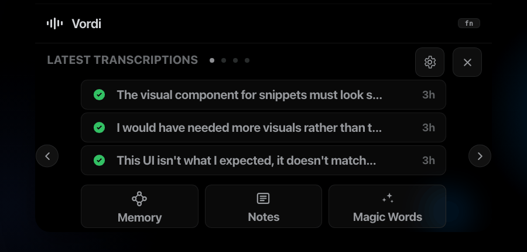
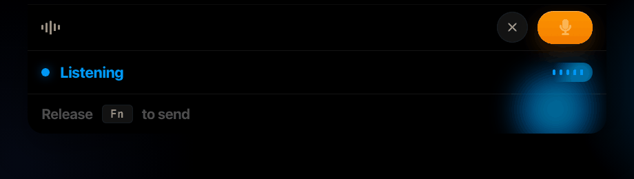
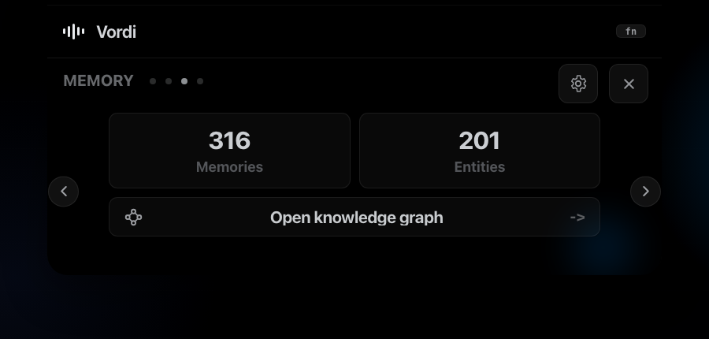
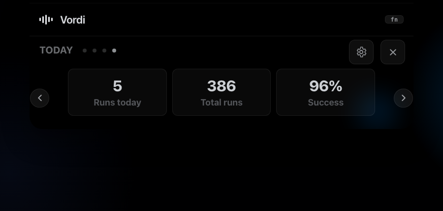

<p align="center">
  
</p>

<h1 align="center">Vordi</h1>

<p align="center">
  <strong>Voice typing for macOS that lives in your notch.</strong><br/>
  Hold <code>fn</code>, speak naturally, release. Vordi listens, cleans, remembers, and types into the app you were already using.
</p>

<p align="center">
  <a href="https://github.com/Raunaks068619/Vordi/releases/latest"></a>
  <a href="LICENSE"></a>
  <a href="#quickstart"></a>
  <a href="#system-requirements"></a>
  <a href="#providers"></a>
  <a href="#privacy-model"></a>
</p>

<p align="center">
  <a href="https://github.com/Raunaks068619/Vordi/releases/latest"><strong>Download DMG</strong></a>
  ·
  <a href="#quickstart"><strong>Install with Homebrew</strong></a>
  ·
  <a href="docs/landing/index.html"><strong>Landing page</strong></a>
  ·
  <a href="PERMISSIONS.md"><strong>Permissions guide</strong></a>
</p>

<p align="center">
  
</p>

## What changed in v0.6.3

The current build moves Vordi toward the modern voice-first workflow users expect from tools like Wispr Flow, Superwhisper, Aqua, and MacWhisper, while keeping Vordi's own identity: a native macOS notch surface, local run history, local Memory, and open-source packaging.

- New Vordi name, logo, app icon, cask, docs, and release pipeline.
- Dynamic Notch UI with listening, thinking, done, error, and expanded panel states.
- Hover panel for latest transcriptions, Notes, Memory, Magic Words, and daily stats.
- Fn-first dictation with `Ctrl+Fn` hands-free mode and `Esc` to exit.
- Output controls simplified to `Original`, `English output`, and `Translate`.
- Magic Words, rich Notes, Run Log, Ask Memory, and Knowledge Graph are first-class surfaces.
- Homebrew tap moved to `raunaks068619/vordi/vordi`.

## Why Vordi

Most dictation apps compete on the same baseline: voice-to-text in every app, AI cleanup, custom prompts, provider choice, and transcript history. Vordi uses that bar as the floor, then adds a Mac-native workflow built around the notch and local context.

| Modern dictation expectation | Vordi's take |
|---|---|
| Works in any app | Hold `fn`, speak, release. Vordi injects into the focused field with synthesized macOS events. |
| Fast visual feedback | A Dynamic Notch surface shows listening, thinking, done, errors, and hands-free state without opening a window. |
| AI cleanup | Dictation and Rewrite modes route through Groq, OpenAI, or local OpenAI-compatible models. |
| Custom vocabulary | User vocabulary and profile-aware cleanup protect product names, people, commands, and code terms. |
| Context-aware output | Vordi can capture active app/window context, selected text, and optional screenshot context from Settings. |
| History | Run Log stores the full local pipeline: audio, raw STT, final text, model route, latency, prompts, and errors. |
| Memory | Past dictations become a local searchable corpus, entity graph, and Ask Memory chat with cited sources. |
| Workflow commands | Magic Words turn spoken triggers into snippets, app actions, and repeatable command expansions. |

## Product tour

<p align="center">
  
</p>

These README captures are generated from [docs/vordi-notch.html](docs/vordi-notch.html), the web replica used to validate the notch states, panel spacing, and slide isolation.

```bash
python3 docs/readme/capture_notch_media.py
```

### Dynamic Notch

The primary UI is a black notch-mounted pill, not a floating modal. It stays within menu-bar height while idle, thinking, and done. It only drops down for active listening or when the expanded panel is opened.

- `fn` listening state with live meter and release affordance.
- Thinking dots and done tick for quick post-release feedback.
- Hover panel with carousel slides for transcripts, Notes, Memory, and stats.
- No focus stealing while you are writing in another app.

### Output modes

| Mode | What lands in the target app |
|---|---|
| `Original` | Raw transcription with minimal cleanup. Best when exact words matter. |
| `English output` | Mixed speech written in English letters. Useful for Hinglish and multilingual workflows. |
| `Translate` | Spoken input translated into natural English. |

Processing mode decides how much the LLM reshapes the result:

- `Dictation`: keep phrasing close to what you said.
- `Rewrite`: tighten grammar, collapse restarts, and improve structure before injection.

### Magic Words

Magic Words are spoken triggers that expand during cleanup. Use them for repeatable snippets, dev commands, and app actions.

Examples:

```text
"open codex and draft a release checklist"
"git wip"
"reply with thanks for the context"
"summarize this as action items"
```

### Notes

Vordi includes a rich-text Notes workspace and a detachable floating notes window. You can dictate into notes, keep release thoughts nearby, and use the notch panel to jump back into the surface quickly.

### Memory and Run Log

<p align="center">
  
  
</p>

Run Log is the audit trail for a dictation. Memory is what happens when those runs become useful later.

| Surface | What it does |
|---|---|
| Run Log | Lists every dictation with audio, raw text, final text, provider, model, prompt metadata, latency, and errors. |
| Memory Store | Stores transcript history locally with SQLite and full-text search. |
| Knowledge Graph | Extracts people, projects, tools, concepts, commands, and relationships from your dictations. |
| Ask Memory | Answers questions over past dictations using hybrid retrieval and cited local sources. |

## Quickstart

### Homebrew

```bash
brew install --cask raunaks068619/vordi/vordi
```

### Manual DMG

1. Download the latest DMG from [Releases](https://github.com/Raunaks068619/Vordi/releases/latest).
2. Drag `Vordi.app` to `/Applications`.
3. Right-click `Vordi.app`, then choose Open.

Current public builds are ad-hoc signed beta builds. If macOS quarantine blocks launch, run:

```bash
xattr -dr com.apple.quarantine /Applications/Vordi.app
codesign --force --deep --sign - /Applications/Vordi.app
open /Applications/Vordi.app
```

### Run from source

```bash
open Vordi.xcodeproj
```

Select the `Vordi` scheme in Xcode 15 or newer, then run `Product -> Run`.

## System requirements

| Requirement | Details |
|---|---|
| macOS | macOS 13 Ventura or newer |
| CPU | Apple Silicon recommended |
| Permissions | Microphone, Accessibility, Input Monitoring |
| App type | Menu-bar app, no Dock icon by design |
| Release | `v0.6.3`, build `21` |

## Hotkeys

| Shortcut | Behavior |
|---|---|
| `fn` hold | Record while held, transcribe and inject on release. |
| `Ctrl+fn` | Start hands-free mode. |
| `fn` while hands-free | Stop hands-free mode and process the recording. |
| `Esc` | Exit hands-free mode without another `fn` press. |

If `fn` does not register, set `System Settings -> Keyboard -> Press fn key to` to `Do Nothing` or disable the macOS Dictation shortcut that consumes the globe / fn key.

## Providers

Vordi separates transcription, cleanup, and Memory answers so you can pick the right tradeoff.

| Layer | Options |
|---|---|
| Transcription | Groq or OpenAI Whisper-compatible paths, with realtime transcription support where configured. |
| Cleanup / rewrite | Groq, OpenAI, LM Studio, Ollama, or another OpenAI-compatible chat endpoint. |
| Memory chat | Current polish backend, local HTTP models, or detected local CLI backends such as Claude Code, Codex CLI, and Gemini CLI. |

Provider defaults are practical: Groq gives a free fast path, OpenAI unlocks stronger paid processing, and local models keep cleanup or Memory chat on your machine when you run LM Studio or Ollama.

## Privacy model

Vordi is local-first for history and memory, not cloud-only.

- Run Log files live under Application Support.
- Memory uses local SQLite, FTS5, embeddings, and entity links.
- Clipboard capture is opt-in and off by default.
- Screenshot context is opt-in from Settings.
- Audio/text is sent to whichever transcription or LLM provider you configure, unless you route that layer to a local model.

## Permissions

Vordi needs three macOS permissions:

| Permission | Why |
|---|---|
| Microphone | Capture your voice while the hotkey is active. |
| Accessibility | Paste or type the final text into the focused app. |
| Input Monitoring | Detect global `fn` and `Ctrl+fn` outside Vordi. |

If a permission is missing, Vordi disables the relevant hotkey path and shows a guided fix. For step-by-step help, read [PERMISSIONS.md](PERMISSIONS.md).

## Feature map

| Area | Implemented |
|---|---|
| Core dictation | Global fn capture, audio recording, VAD filtering, transcription, injection. |
| Dynamic Notch | Idle, listening, thinking, done, error, hands-free, hover panel. |
| Floating chip | Optional draggable status surface for non-notch workflows. |
| Transforms | Standard cleanup, Developer Mode, Agentic Developer Mode, Prompt Engineer, variable recognition. |
| Magic Words | User-managed triggers, snippet expansion, app actions, prefix matching. |
| Context | Frontmost app, selected text, optional clipboard fallback, optional screenshot context. |
| Memory | Local corpus, embeddings, graph, Ask Memory, local LLM routing. |
| Notes | Rich-text notes workspace, floating notes, dictated voice notes. |
| Insights | Usage stats and inferred work profile. |
| Packaging | Homebrew cask, DMG release scripts, signing/notarization support. |

See [FEATURES.md](FEATURES.md) for the implementation-level feature inventory.

## Project structure

```text
Sources/App        App lifecycle, permissions, hotkeys, menu-bar behavior
Sources/Services   audio, transcription, context, memory, providers, injection
Sources/Views      Dynamic Notch, dashboard, settings, notes, memory, run log
Resources          plist, entitlements, app icon, brand assets
docs               landing page, notch prototype, README captures, product notes
scripts            build, install, release, signing, verification helpers
homebrew-vordi     local checkout of the Homebrew tap
```

## Release

The latest release is [v0.6.3](https://github.com/Raunaks068619/Vordi/releases/tag/v0.6.3).

```text
DMG:    Vordi-Beta.dmg
SHA256: 76c2e40bc3369f97b67c61919e36e1e36c075cf9afcb8354e83c907c8e82860d
Cask:   raunaks068619/vordi/vordi
```

## License

MIT. See [LICENSE](LICENSE).

MIT covers source-code copyright. It does not replace Apple Developer ID signing or notarization for a frictionless macOS install.
